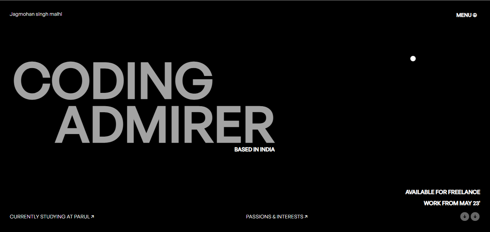
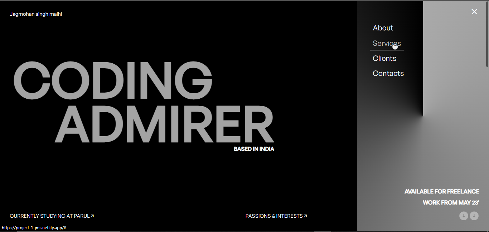
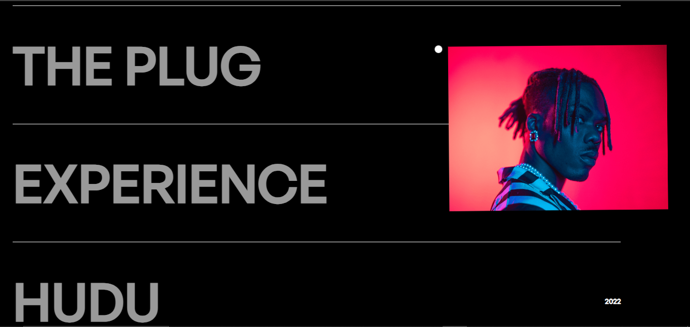
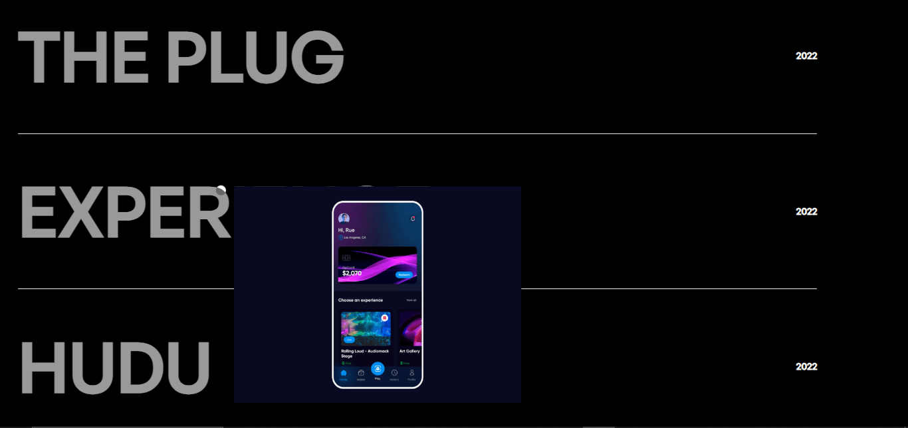
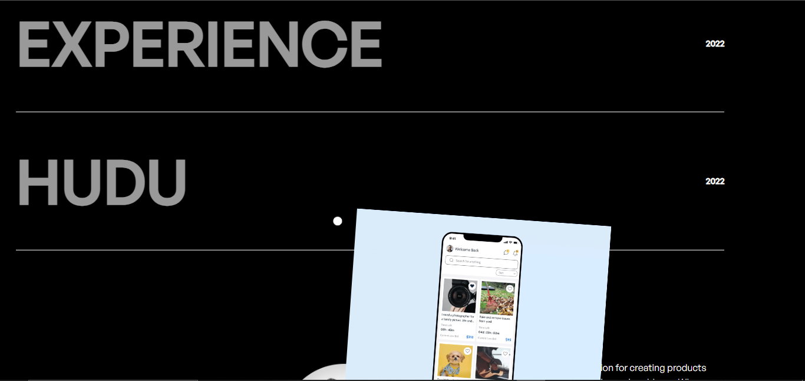
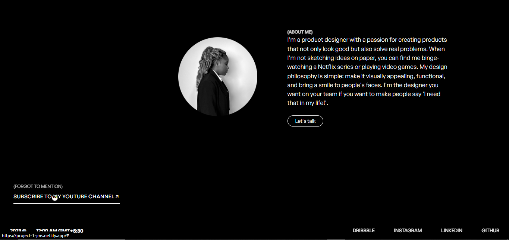

# PROJECT-1: Landing-Page Clone
Portfolio Website from Awwwards

## Overview
This is the code for a personal portfolio website, showcasing the skills and projects of the developer. The website is designed with a modern and dynamic look, incorporating smooth scrolling, creative animations, and a responsive layout.

## Key Features
- **Navigation:** A clean and stylish navigation bar with a responsive sidebar for easy access to different sections.
- **Hero Section:** Eye-catching hero section with a name, tagline, and engaging animations.
- **Interactive Elements:** The website features a dot that follows the mouse, providing a unique and interactive experience.
- **Section Transitions:** Smooth transitions between sections, enhancing the overall user experience.
- **Project Showcase:** The second section displays three projects with images, titles, and publication years.
- **About Me:** A section introducing Jagmohan Singh Malhi, including a profile image and a brief description of his design philosophy and interests.
- **Subscription Call-to-Action:** Encourages users to subscribe to the developer's YouTube channel.
- **Footer:** Includes copyright information, real-time clock, and links to social media profiles.

## Technologies Used
- **HTML5:** Markup language for structuring the content.
- **CSS3:** Styling language for layout and presentation.
- **JavaScript:** Used for interactive elements, animations, and functionality.
- **External Libraries:** Utilizes Locomotive Scroll for smooth scrolling and GSAP for animations.

## Responsive Design
The website is designed to be responsive, ensuring a seamless and enjoyable user experience across various devices. Media queries are employed to adjust styles for small screens.

## Screenshots









## Project Structure

```
project-1/
├── src/
│   ├── index.html              # Main HTML file
│   ├── styles/
│   │   ├── style.css          # Main stylesheet
│   │   └── loco.css           # Locomotive Scroll styles
│   ├── scripts/
│   │   ├── script.js          # Main JavaScript
│   │   └── s2.js              # Additional scripts
│   └── assets/
│       ├── images/            # Project images
│       │   ├── cynthia.png
│       │   ├── hudu.png
│       │   ├── ixperience.png
│       │   ├── plug.png
│       │   └── profile.jpg
│       ├── icons/             # Favicons and icons
│       │   └── icon.ico
│       └── fonts/             # Custom fonts
│           ├── Space-grotesk.ttf
│           └── Space-grotesk.woff2
├── public/                    # Build output directory
├── docs/
│   ├── screenshots/           # Project screenshots
│   └── reference/             # Reference materials
├── netlify.toml              # Netlify configuration
├── _redirects                # Netlify redirects
├── robots.txt                # SEO robots file
├── package.json              # Dependencies
└── README.md                 # This file
```

## How to Use
1. Clone the repository.
2. Install dependencies: `npm install`
3. Run development server: `npm start`
4. Open `http://localhost:3000` in a web browser to explore the website.
5. Build for production: `npm run build`

## Credits
- **Original Website:** [https://www.cynthiaugwu.com/](https://www.cynthiaugwu.com/)
- **Locomotive Scroll:** [https://github.com/locomotivemtl/locomotive-scroll](https://github.com/locomotivemtl/locomotive-scroll)
- **GSAP (GreenSock Animation Platform):** [https://greensock.com/gsap/](https://greensock.com/gsap/)
- **Remixicon:** [https://remixicon.com/](https://remixicon.com/)
- **Font Share:** [https://www.fontshare.com/](https://www.fontshare.com/)

## Author
[Jagmohan Singh Malhi](https://www.linkedin.com/in/jagmohan-singh-malhi-a67805243/)
